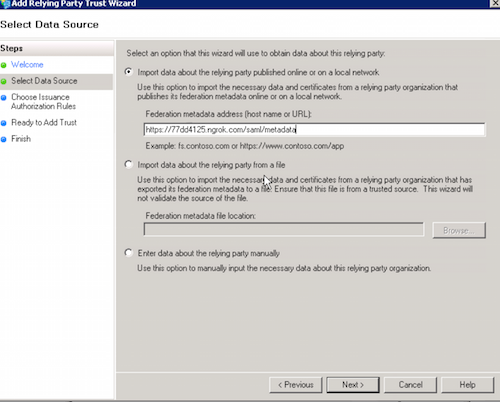
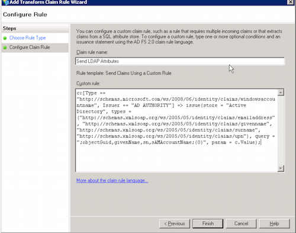

# ADFS setup and configuration

This guide provides an example of how to configure ADFS for acting as an Identity Provider (IdP) for this module. We assume you have already followed the [SAML Service Provider (SP) Setup](docs/en/saml_setup.md) guide.

This is not an exhaustive guide, and it only covers one operating system (Windows Server 2008 RC2) and one specific version of ADFS (2.0).

As an implementor of the IdP, you will need to ensure the following have been set up:

* Establishing bi-directional trust between SP and IdP
* Adding a claim rule to send LDAP attributes
* Adding a claim rule to use objectId as nameidentifier
* Ensuring compatible hash algorithm is used

This guide will hopefully give you enough context to do so.

## Install ADFS 2.0

This module is using ADFS 2.0 as an identity provider that issues SAML tokens for the identities it manages.
For that, a new relying party needs to be created. A relying party in ADFS 2.0 is a representation of an
application (a Web site or a Web service) and contains all the security-related information, such as
encryption certificate, claims transformation rules and so on.

## Configuration of the Identity Provider (IdP)

As part of this we will establish the trust between this IdP and the SilverStripe's Service Provider. ADFS will download the public certificate we have generated in the "SAML Service Provider (SP) Setup" guide.

### Create a new relying party trust

and click "Start"

### Select Data Source

"Federation metadata address (host name or URL):" should be the SilverStripe SAML metadata endpoint, e.g:
"https://77dd4125.ngrok.com/saml/metadata".

### Specify Display Name

Here you can add any notes, for example who would be the technical contact for the SP.

## Setup claim rules

Claim rules decide what fields are used for performing authentication, and what is provided to the Service Provider as a context.

Two claim rules are absolutely required for this module to work. We will set these up now.

Right click the relying party and choose "Edit Claim Rules".

### Rule 1: Send LDAP Attributes

This rule makes arbitrary LDAP Attributes available for SAML authentication. We surface such parameters as "mail" for use as login, "givenName" and "sn" for identifying the person and "objectGuid" so that we can establish uniqueness of records.

Click "Add Rule" and select "Send Claims Using a Custom Rule" from the dropdown.
Add the following rule:

	c:[Type == "http://schemas.microsoft.com/ws/2008/06/identity/claims/windowsaccountname", Issuer == "AD AUTHORITY"] => issue(store = "Active Directory", types = ("http://schemas.xmlsoap.org/ws/2005/05/identity/claims/emailaddress", "http://schemas.xmlsoap.org/ws/2005/05/identity/claims/givenname", "http://schemas.xmlsoap.org/ws/2005/05/identity/claims/surname", "http://schemas.xmlsoap.org/ws/2005/05/identity/claims/privatepersonalidentifier"), query = ";mail,givenName,sn,objectGuid;{0}", param = c.Value);
	

### Rule 2: Send objectId as nameidentifier

This rule makes use of the previous one. SAML requires a unique identifier to perform the authentication. "objectId" AD Attribute is such a unique token, and we direct ADFS to use it for this purpose.

Repeat the same "Add Rule" as done above and select "Send Claims Using a Custom Rule" from the dropdown to add this rule:

	c:[Type == "http://schemas.xmlsoap.org/ws/2005/05/identity/claims/privatepersonalidentifier"] => issue(Type = "http://schemas.xmlsoap.org/ws/2005/05/identity/claims/nameidentifier", Issuer = c.Issuer, OriginalIssuer = c.OriginalIssuer, Value = c.Value, ValueType = c.ValueType, Properties["http://schemas.xmlsoap.org/ws/2005/05/identity/claimproperties/format"] = "urn:oasis:names:tc:SAML:2.0:nameid-format:transient");

## Set the secure hash algorithm

By default ADFS 2.0 uses a hash algorithm incompatible with *silverstripe-activedirectory* SAML implementation. You will need to change it from SHA-256 to SHA-1.

1. Right click the relying party and choose properties.
2. Choose the "Advanced" tab and select the "SHA-1" option in the dropdown and press OK.

