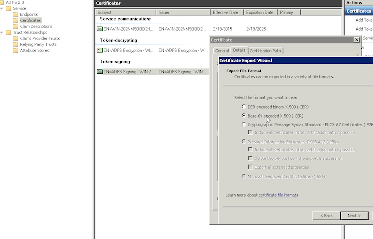

# SAML Service Provider (SP) Setup

This guide will step you through the configuration steps for configuring SilverStripe as a SAML Service Provider (SP).

## SSL Certificates

SAML uses pre-shared certificates for establishing trust between the SP (here, SilverStripe) the Identity Provider (IdP) side (here, ADFS). Both SP and IdP need a certificate, and both need to have the public key of their counterparty.

### Service Provider certificate

You need to create an SSL certificate and private key for signing SAML requests. One way to generate self signed test certificates is by using the `openssl` command

	openssl req -x509 -nodes -newkey rsa:2048 -keyout saml.pem -out saml.crt -days 1826

These should not be checked into the source code and should be placed outside of the
web document root for security reasons. Store the path to the certificate and the private key for the configuration step that follows.

### Exporting the token-signing certificate from ADFS

You need to get the token-signing certificate from the ADFS (acting as IdP) and copy it somewhere where it can be reached by your SilverStripe site (acting as an SP).

You can get it by either parsing it out from the endpoint `https://mydomain.com/FederationMetadata/2007-06/FederationMetadata.xml`
or by exporting the certificate manually using ADFS console on Windows.
In this documentation we're going to manually extract the certificate.

In the ADFS console, go to Services > Certificates and right click the "Token-signing" certificate.
Click the "Details" tab and click "Copy to file".

A wizard opens, click "Next" and then choose "Base-64 encoded X.509 (.CER)".
Click "Next" and choose a place to export the certificate. Click "Next" to finish the process.

Copy the certificate to your SilverStripe machine, and record the path for the following configuration step.

## YAML configuration

Now we need to make the *silverstripe-activedirectory* module aware of where the certificates can be found. 

Note that this configuration relies on a particular IdP setup as documented in [ADFS 2.0 setup and configuration](docs/en/adfs_setup.md). 

Add the following configuration to `mysite/_config/saml.yml` (make sure to replace paths to the certificates and keys):

	---
	Name: mysamlsettings
	After:
	  - "#samlsettings"
	---
	SAMLConfiguration:
	  strict: true
	  debug: false
	  SP:
	    entityId: "https://25b5994c.ngrok.com"
	    privateKey: "<path-to-silverstripe-private-key>/saml.pem"
	    x509cert: "<path-to-silverstripe-cert>/saml.crt"
	  IdP:
	    entityId: "https://mydomain.com/adfs/services/trust"
	    x509cert: "<path-to-adfs-cert>/adfs_certificate.pem"
	    singleSignOnService: "https://mydomain.com/adfs/ls/"

Important: `entityId` must match *exactly* to the correct URL, including protocol, otherwise you will
get errors like "Invalid issuer". In ADFS, you can find that by checking the "Federation Service Properties".

### Service Provider (SP)

 - `entityId`: This should be the base URL with https for the SP
 - `privateKey`: The private key used for signing SAML request
 - `x509cert`: The public key that the IdP is using for verifying a signed request

### Identity Provider (IdP)

 - `entityId`: Provided by the IdP, but for ADFS it's typically "https://domain.com/adfs/services/trust"
 - `x509cert`: The token-signing certificate from ADFS (base 64 encoded)
 - `singleSignOnService`: The endpoint on ADFS for where to send the SAML login request
 
## Debugging

To enable some very light weight debugging from the 3rd party library set the `debug` to true

	SAMLConfiguration:
	  debug: true

In general it can be tricky to debug what is failing during the setup phase. The SAML protocol error
message as quite hard to decipher.

In most cases it's configuration issues that can debugged by using the ADFS 2.0 Event log, see the
[Diagnostics in ADFS 2.0](http://blogs.msdn.com/b/card/archive/2010/01/21/diagnostics-in-ad-fs-2-0.aspx)
for more information.

Also ensure that all protocols are matching. SAML is very sensitive to differences in http and https in URIs.

## Advanced configuration

It is possible to customize all the settings provided by the 3rd party SAML code.
 
This can be done by registering your own `SAMLConfiguration` object via `mysite/_config/saml.yml`:
 
Example:

	---
	Name: samlconfig
	After:
	  - "#samlsettings"
	---
	Injector:
	  SAMLConfService: MySAMLConfiguration

and the MySAMLConfiguration.php:

	<?php
	class MySAMLConfiguration extends Object {
		public function asArray() {
			return array(
				// add settings here;
			);
		}
	}

See the [advanced_settings_example.php](https://github.com/onelogin/php-saml/blob/master/advanced_settings_example.php)
for the advanced settings.

## Resources

 - [ADFS Deep-Dive: Onboarding Applications](http://blogs.technet.com/b/askpfeplat/archive/2015/03/02/adfs-deep-dive-onboarding-applications.aspx)
